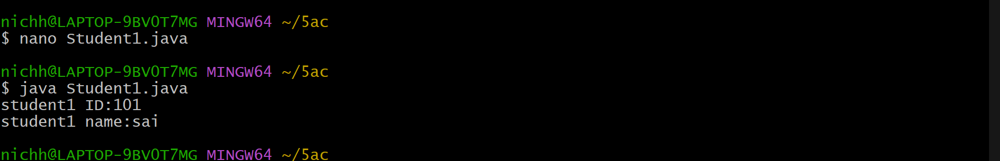

## Experiment2
# TITLE : 2a.) Display the Student
```
lass student1{
int id;
String name;
void setdata(int i,String n){
id =i;
name=n;
}
void display(){
System.out.println("student1 ID:"+id);
System.out.println("student1 name:"+name);
}
public static void main(String[] args){
student1 s1=new student1();
s1.setdata(101,"sai");
s1.display();
}
}
```
# output

# TITLE :2b .) Display the MethodOverloading
```
class MethodOverloading {
int add(int a,int b){
return a+b;
}
int add(int a,int b,int c){
return a+b+c;
}
double add(double a,double b){
return a+b;
}
public static void main(String[] args){
MethodOverloading obj =new MethodOverloading();
System.out.println("Addition of two integers:"+obj.add(10,20));
System.out.println("Addition of three integers;"+obj.add(5,10,15));
System.out.println("Addition of doubles:"+obj.add(2.5,3.5));
}
}


